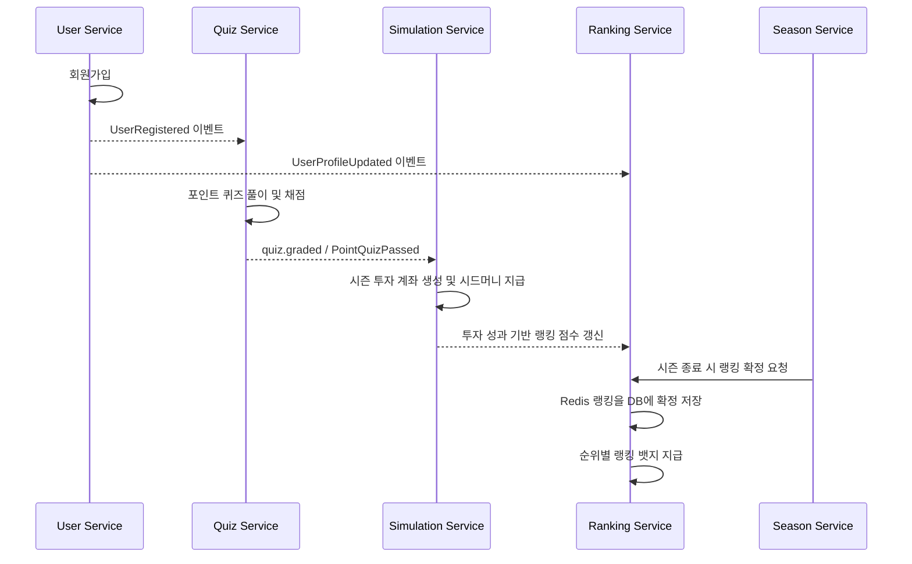
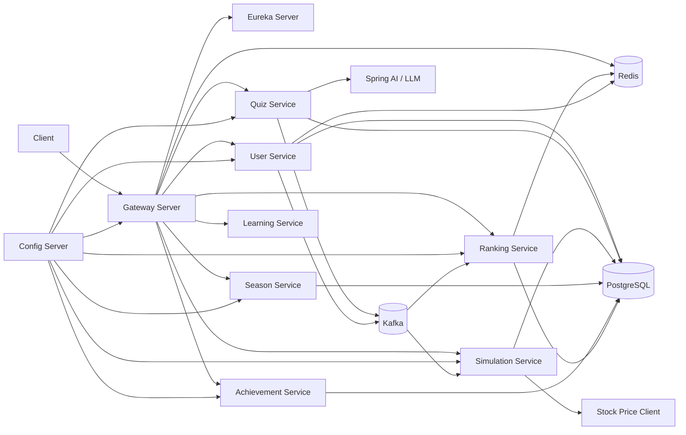

# FinLearn

<div align="center">

**퀴즈로 금융 지식을 학습하고, 모의투자로 실전 감각을 쌓는 금융 학습 플랫폼**

</div>

## 프로젝트 소개

> **"배운 금융 지식을 바로 투자 경험으로 연결한다"**

**FinLearn**은 금융 학습, 퀴즈, 시즌제 모의투자, 랭킹, 업적을 하나의 흐름으로 연결하는 MSA 기반 백엔드 프로젝트입니다.

사용자는 금융 개념을 학습하고 퀴즈를 풀며 시드머니를 획득합니다. 획득한 시드머니는 시즌별 투자 계좌로 지급되고, 사용자는 주식/ETF 종목을 조회하거나 매수/매도하며 모의투자 경험을 쌓을 수 있습니다. 투자 결과는 랭킹과 뱃지, 업적 시스템으로 이어져 학습 동기를 강화합니다.

### 핵심 목표

- 금융 지식 학습과 퀴즈 풀이를 통한 진입 장벽 완화
- 퀴즈 성과를 시드머니로 전환해 학습과 투자 경험 연결
- 시즌제 투자, 랭킹, 뱃지, 업적을 통한 지속적인 참여 유도
- 서비스별 책임을 분리한 Spring Cloud 기반 MSA 구성
- 공통 응답, 예외, 보안 헤더, Kafka, 모니터링 설정을 공통 모듈로 표준화

---

## 기술 스택

### Backend


### Database & Messaging


### Infrastructure & Observability


### Documentation & Test


---

## 서비스 구성

| 서비스 | 포트 | 역할 | Repository |
| --- | ---: | --- | --- |
| `gateway-server` | 8080 | 외부 진입점, JWT 검증, 라우팅, Swagger API Docs 집계 | [gateway-server](https://github.com/F1NLEARN/gateway-server) |
| `user-service` | 8081 | 회원가입, 로그인, 토큰 재발급, 로그아웃, 내 정보/프로필 관리 | [user-service](https://github.com/F1NLEARN/user-service) |
| `quiz-service` | 8082 | 학습/포인트 퀴즈 세션, 답안 제출, 퀴즈 ETL, Outbox 기반 이벤트 발행 | [quiz-service](https://github.com/F1NLEARN/quiz-service) |
| `simulation-service` | 8083 | 투자 계좌, 종목/현재가, 관심 종목, 매수/매도, 보유 종목, 거래 이력, 포트폴리오 분석 | [simulation-service](https://github.com/F1NLEARN/simulation-service) |
| `season-service` | 8084 | 시즌 조회, 현재 시즌 조회, 시즌 참여 등록, 시드머니 산정 | [season-service](https://github.com/F1NLEARN/season-service) |
| `achievement-service` | 8085 | 업적 목록, 내 업적, 시즌별 업적 카운트 | [achievement-service](https://github.com/F1NLEARN/achievement-service) |
| `ranking-service` | 8086 | 실시간/확정 랭킹, 내 랭킹, 랭킹 뱃지, 시즌 종료 랭킹 확정 | [ranking-service](https://github.com/F1NLEARN/ranking-service) |
| `learning-service` | 8087 | 학습 도메인 확장 예정 서비스 | [learning-service](https://github.com/F1NLEARN/learning-service) |
| `config-server` | 8888 | Git/native 기반 중앙 설정 제공 | [config-server](https://github.com/F1NLEARN/config-server) |
| `eureka-server` | 8761 | 서비스 디스커버리 | [eureka-server](https://github.com/F1NLEARN/eureka-server) |
| `common` | - | 공통 응답, 예외, 보안, Kafka, Redis, JPA Auditing, Swagger, 로깅 자동 설정 | [common](https://github.com/F1NLEARN/common) |
| `configs` | - | 서비스별 외부 설정 저장소 | [configs](https://github.com/F1NLEARN/configs) |
| `frontend` | - | FinLearn 클라이언트 애플리케이션 | [frontend](https://github.com/F1NLEARN/frontend) |

---

## 핵심 기능

### User Service

- **회원가입:** 이메일과 닉네임 중복을 검증하고 비밀번호를 암호화해 사용자를 생성합니다. 가입 완료 후 `UserCreatedEvent`를 발행하여 다른 서비스가 사용자 생성 사실을 구독할 수 있도록 합니다.
- **로그인:** 사용자 상태와 비밀번호를 검증한 뒤 Access Token과 Refresh Token을 발급합니다. Refresh Token은 저장소에 보관하고 재로그인 시 회전시킵니다.
- **토큰 재발급:** Refresh Token의 서명, 타입, 저장된 토큰 일치 여부, 만료 시간을 검증한 뒤 Access Token과 Refresh Token을 새로 발급합니다.
- **로그아웃:** Refresh Token 기반 로그아웃과 Access Token 기반 로그아웃을 모두 지원합니다. Access Token 로그아웃은 남은 만료 시간만큼 Redis 블랙리스트에 저장하는 방식으로 처리합니다.
- **내 정보 조회:** Gateway가 주입한 `X-User-Id` 헤더를 기준으로 현재 사용자 정보를 조회합니다.
- **프로필 조회/수정:** 닉네임, 프로필 이미지, 장착 뱃지를 관리합니다. 닉네임 또는 이미지가 변경되면 `UserProfileUpdatedEvent`를 발행해 랭킹 등 사용자 스냅샷을 가진 서비스가 동기화할 수 있게 합니다.
- **내부 사용자 조회:** 서비스 간 통신을 위해 사용자 ID 또는 이메일로 내부 사용자 정보를 조회하는 API를 제공합니다.

### Quiz Service

- **학습 퀴즈 세션 생성:** 사용자가 선택한 금융 카테고리에서 랜덤 문제를 추출해 학습용 퀴즈 세션을 생성합니다.
- **포인트 퀴즈 세션 생성:** 전체 카테고리에서 랜덤 문제를 출제하며, 월 단위로 완료된 포인트 퀴즈가 있으면 중복 생성을 차단합니다.
- **문제 조회:** 세션 ID와 문제 순번을 기준으로 현재 풀어야 할 문제를 조회합니다. 세션 소유자 검증을 통해 다른 사용자의 세션 접근을 방지합니다.
- **답안 제출:** 제출한 선택지와 정답을 비교하고 세션 도메인에 정오답 결과를 반영합니다. 포인트 퀴즈 통과 여부에 따라 시드머니 지급 이벤트를 발행합니다.
- **세션 종료:** 진행 중인 퀴즈 세션을 종료하고 최종 상태를 응답합니다.
- **퀴즈 ETL:** 관리자 API를 통해 키워드 생성, 위키피디아 크롤링, 청킹/임베딩, 퀴즈 생성 및 품질 검증 파이프라인을 실행합니다.
- **Outbox 이벤트 발행:** 퀴즈 제출/채점 이벤트를 도메인 트랜잭션 안에서 Outbox 테이블에 저장하고, Relay가 주기적으로 Kafka에 발행해 메시지 유실 가능성을 낮춥니다.

### Simulation Service

- **투자 계좌 생성/조회:** 포인트 퀴즈 통과 이벤트를 기반으로 시즌 투자 계좌를 생성하고 시드머니를 지급합니다. 사용자는 자신의 투자 계좌를 조회할 수 있습니다.
- **종목 목록/상세 조회:** 주식/ETF 종목을 자산 유형, 키워드, 페이지 조건으로 조회하고 종목 상세 정보를 확인할 수 있습니다.
- **현재가 조회:** 외부 시세 클라이언트 또는 저장된 종목 가격 정보를 기반으로 현재가를 조회합니다.
- **관심 종목 관리:** 사용자는 관심 종목을 등록, 조회, 삭제할 수 있습니다.
- **매수/매도 주문:** 보유 현금, 보유 수량, 종목 가격을 검증한 뒤 매수/매도 주문을 처리합니다.
- **보유 종목 조회:** 사용자의 보유 종목과 평가 정보를 조회합니다.
- **거래 이력 조회:** 종목 코드, 거래 유형, 페이지 조건으로 사용자의 매매 이력을 조회합니다.
- **포트폴리오 분석:** 보유 종목을 기준으로 포트폴리오 구성과 분석 정보를 제공합니다.
- **투자 이벤트 발행:** 계좌 개설, 시드머니 지급, 매수, 매도 이벤트를 발행해 랭킹/업적 등 후속 처리가 이어질 수 있게 합니다.

### Season Service

- **시즌 목록 조회:** 전체 시즌의 번호, 시작일, 종료일, 상태를 조회합니다.
- **현재 시즌 조회:** `ACTIVE` 상태의 현재 진행 중인 시즌을 조회합니다.
- **내 시즌 참여 정보 조회:** 특정 시즌에 대한 사용자의 참여 정보와 지급된 시드머니 정보를 확인합니다.
- **시즌 참여 등록:** 진행 중인 시즌에 사용자를 등록합니다. 이미 참여한 사용자는 중복 등록을 차단합니다.
- **시드머니 산정:** 통과한 카테고리 수를 기준으로 기본 시드머니를 계산하고, 업적/랭킹 보너스를 합산할 수 있는 구조를 제공합니다.
- **시즌 상태 관리:** 시즌 도메인은 `UPCOMING -> ACTIVE -> ENDED` 흐름을 가지며, 유효하지 않은 상태 전이를 방지합니다.

### Achievement Service

- **업적 목록 조회:** 업적 카테고리와 난이도 조건으로 업적 목록을 필터링할 수 있습니다.
- **내 업적 조회:** 사용자 ID 기준으로 획득한 업적을 조회하고, 시즌 ID를 전달하면 시즌별 업적만 조회할 수 있습니다.
- **업적 카운트 내부 API:** 시즌 서비스가 시드머니 보너스 산정에 활용할 수 있도록 사용자/시즌별 업적 획득 수를 제공합니다.
- **업적 도메인:** 업적명, 카테고리, 난이도, 조건 타입, 조건 값을 관리합니다.
- **업적 뱃지 확장:** `achievement_badges` 테이블과 도메인 구조를 통해 업적 기반 뱃지 지급 확장을 준비합니다.

### Ranking Service

- **시즌 랭킹 조회:** 진행 중인 시즌은 Redis Sorted Set에서 실시간 랭킹을 조회하고, 종료된 시즌은 PostgreSQL에 확정 저장된 랭킹을 조회합니다.
- **내 랭킹 조회:** 특정 시즌에서 사용자의 모든 랭킹 타입별 순위와 점수를 조회합니다.
- **랭킹 점수 갱신:** Simulation Service 등 내부 서비스가 시즌, 사용자, 랭킹 타입, 점수를 전달하면 Redis 랭킹 점수를 갱신합니다.
- **랭킹 확정:** 시즌 종료 시 Redis에 있는 실시간 점수를 PostgreSQL에 최종 순위로 확정하고 시즌 데이터를 정리합니다.
- **랭킹 뱃지 지급:** `ALL` 랭킹 기준으로 1위는 `CHAMPION`, 상위 10%는 `GOLD`, 상위 30%는 `SILVER`, 상위 50%는 `BRONZE` 뱃지를 지급합니다.
- **사용자 스냅샷:** 사용자 닉네임과 프로필 이미지를 랭킹 테이블에 스냅샷으로 보관해 조회 성능과 독립성을 확보합니다.

### Gateway Server

- **서비스 라우팅:** Spring Cloud Gateway MVC 기반으로 사용자, 학습, 퀴즈, 시뮬레이션, 시즌, 업적, 랭킹 서비스 요청을 각 서비스로 전달합니다.
- **JWT 검증:** Authorization 헤더의 JWT를 검증하고 사용자 ID/권한 정보를 다운스트림 서비스로 전달합니다.
- **사용자 헤더 주입:** 인증된 요청에 `X-User-Id`, `X-User-Role` 헤더를 추가해 각 서비스가 인증 컨텍스트를 단순하게 사용할 수 있도록 합니다.
- **Swagger 문서 집계:** 각 서비스의 `/v3/api-docs`를 Gateway Swagger UI에서 모아볼 수 있도록 라우팅합니다.
- **Resilience4j 연동:** Circuit Breaker 기반 장애 격리와 회복 전략을 적용할 수 있는 구조를 갖추고 있습니다.

### Common Module

- **공통 응답 포맷:** `CommonResponse<T>`로 성공 응답의 `success`, `message`, `data`, `traceId` 구조를 통일합니다.
- **공통 예외 처리:** `CustomException`, Validation 예외, JSON 파싱 예외, 알 수 없는 예외를 일관된 `ErrorResponse`로 변환합니다.
- **JPA Auditing:** 모든 서비스에서 생성/수정 시간을 공통 엔티티로 관리합니다.
- **보안 헤더 필터:** Gateway가 전달한 `X-User-*` 헤더를 읽어 `SecurityContext`를 구성합니다.
- **Kafka 설정:** Producer/Consumer, Listener Container, Error Handler, Dead Letter Topic 구조를 공통화합니다.
- **Redis 설정:** 각 서비스에서 RedisTemplate을 사용할 수 있도록 공통 설정을 제공합니다.
- **Swagger 설정:** SpringDoc 설정을 공통화해 서비스별 API 문서화를 쉽게 합니다.
- **로깅 필터:** 요청 URI와 HTTP Method를 MDC에 넣어 traceId 기반 로그 추적을 돕습니다.

---

## 주요 API

### User

| Method | Endpoint | 설명 |
| --- | --- | --- |
| `POST` | `/api/v1/users/signup` | 회원가입 |
| `POST` | `/api/v1/users/login` | 로그인 |
| `POST` | `/api/v1/users/refresh` | 토큰 재발급 |
| `POST` | `/api/v1/users/logout` | Refresh Token 기반 로그아웃 |
| `POST` | `/api/v1/auth/logout` | Access Token 기반 로그아웃 |
| `GET` | `/api/v1/users/me` | 내 정보 조회 |
| `GET` | `/api/v1/users/me/profile` | 내 프로필 조회 |
| `PATCH` | `/api/v1/users/me/profile` | 내 프로필 수정 |

### Quiz

| Method | Endpoint | 설명 |
| --- | --- | --- |
| `POST` | `/api/quiz/sessions/learning` | 학습 퀴즈 세션 생성 |
| `POST` | `/api/quiz/sessions/point` | 포인트 퀴즈 세션 생성 |
| `GET` | `/api/quiz/sessions/{sessionId}/quizzes/{orderNo}` | 문제 조회 |
| `POST` | `/api/quiz/sessions/{sessionId}/quizzes/{orderNo}/answers` | 답안 제출 |
| `POST` | `/api/quiz/sessions/{sessionId}/close` | 세션 종료 |
| `POST` | `/api/v1/admin/quiz-etl` | 퀴즈 ETL 수동 실행 |

### Simulation

| Method | Endpoint | 설명 |
| --- | --- | --- |
| `POST` | `/api/v1/investments/accounts` | 투자 계좌 생성 |
| `GET` | `/api/v1/investments/accounts/me` | 내 투자 계좌 조회 |
| `GET` | `/api/v1/investments/stocks` | 종목 목록 조회 |
| `GET` | `/api/v1/investments/stocks/{stockCode}` | 종목 상세 조회 |
| `GET` | `/api/v1/investments/stocks/{stockCode}/price` | 현재가 조회 |
| `POST` | `/api/v1/investments/favorites` | 관심 종목 등록 |
| `GET` | `/api/v1/investments/favorites` | 관심 종목 조회 |
| `DELETE` | `/api/v1/investments/favorites/{symbol}` | 관심 종목 삭제 |
| `POST` | `/api/v1/investments/orders/buy` | 매수 주문 |
| `POST` | `/api/v1/investments/orders/sell` | 매도 주문 |
| `GET` | `/api/v1/investments/holdings` | 보유 종목 조회 |
| `GET` | `/api/v1/investments/trades` | 거래 이력 조회 |
| `GET` | `/api/v1/analyses/portfolio` | 포트폴리오 분석 조회 |

### Season, Achievement, Ranking

| 서비스 | Method | Endpoint | 설명 |
| --- | --- | --- | --- |
| Season | `GET` | `/api/v1/seasons` | 시즌 목록 조회 |
| Season | `GET` | `/api/v1/seasons/current` | 현재 시즌 조회 |
| Season | `GET` | `/api/v1/seasons/{seasonId}/me` | 내 시즌 참여 정보 조회 |
| Season | `POST` | `/api/v1/seasons/{seasonId}/participants` | 시즌 참여 등록 |
| Achievement | `GET` | `/api/v1/achievements` | 업적 목록 조회 |
| Achievement | `GET` | `/api/v1/achievements/me` | 내 업적 조회 |
| Ranking | `GET` | `/api/v1/rankings/seasons/{seasonId}` | 시즌 랭킹 조회 |
| Ranking | `GET` | `/api/v1/rankings/seasons/{seasonId}/me` | 내 랭킹 조회 |
| Ranking | `GET` | `/api/v1/rankings/badges/me` | 내 랭킹 뱃지 조회 |

---

## 이벤트 흐름



### 주요 Kafka Topic

| Topic Key | Topic Name | 설명 |
| --- | --- | --- |
| `kafka.topics.user.registered` | `finlearn-user-registered` | 회원가입 이벤트 |
| `kafka.topics.user.updated` | `finlearn-user-updated` | 사용자 정보 변경 이벤트 |
| `kafka.topics.quiz.submitted` | `finlearn-quiz-submitted` | 퀴즈 답안 제출 이벤트 |
| `kafka.topics.quiz.graded` | `finlearn-quiz-graded` | 퀴즈 채점/포인트 퀴즈 통과 이벤트 |
| `kafka.topics.simulation.started` | `finlearn-simulation-started` | 시뮬레이션 시작 이벤트 |
| `kafka.topics.simulation.completed` | `finlearn-simulation-completed` | 시뮬레이션 완료 이벤트 |
| `kafka.topics.achievement.earned` | `finlearn-achievement-earned` | 업적 획득 이벤트 |
| `kafka.topics.ranking.updated` | `finlearn-ranking-updated` | 랭킹 갱신 이벤트 |
| `kafka.topics.season.started` | `finlearn-season-started` | 시즌 시작 이벤트 |
| `kafka.topics.season.ended` | `finlearn-season-ended` | 시즌 종료 이벤트 |

---

## 시스템 아키텍처



---

## 주요 기술적 의사결정

<details>
<summary>Spring Cloud 기반 MSA 구성</summary>

**배경**

FinLearn은 사용자, 퀴즈, 투자 시뮬레이션, 시즌, 업적, 랭킹처럼 기능 경계가 비교적 명확합니다. 각 도메인은 변경 주기와 데이터 모델이 다르기 때문에 단일 애플리케이션보다 서비스별 분리가 적합합니다.

**결정**

- Gateway를 외부 진입점으로 두고 각 서비스는 Eureka에 등록합니다.
- Config Server로 공통/서비스별 설정을 중앙 관리합니다.
- 공통 응답, 예외, 보안 헤더, Kafka 설정은 `common` 라이브러리로 제공합니다.

**효과**

- 서비스별 독립 배포와 확장이 쉬워집니다.
- 도메인별 책임이 분명해지고 테스트 범위를 좁히기 쉽습니다.
- 인증, 응답, 예외, 로깅 같은 횡단 관심사를 중복 구현하지 않아도 됩니다.

</details>

<details>
<summary>퀴즈 이벤트 발행에 Outbox 패턴 적용</summary>

**배경**

포인트 퀴즈 통과는 투자 계좌 생성과 시드머니 지급으로 이어지는 중요한 이벤트입니다. DB 트랜잭션은 성공했지만 Kafka 발행이 실패하면 서비스 간 상태가 어긋날 수 있습니다.

**결정**

- 퀴즈 도메인 이벤트를 같은 트랜잭션 안에서 Outbox 테이블에 저장합니다.
- 별도 Relay가 `PENDING` 이벤트를 읽어 Kafka로 발행하고 `PUBLISHED` 상태로 변경합니다.

**효과**

- 도메인 상태 변경과 이벤트 저장의 원자성을 확보합니다.
- Kafka 일시 장애가 발생해도 미발행 이벤트를 재처리할 수 있습니다.

</details>

<details>
<summary>랭킹은 Redis와 PostgreSQL을 역할별로 분리</summary>

**배경**

시즌 진행 중 랭킹은 점수 변경이 잦고 빠른 순위 조회가 필요합니다. 반면 시즌 종료 후 랭킹은 재현 가능한 확정 데이터로 보존되어야 합니다.

**결정**

- 진행 중 시즌의 랭킹 점수와 순위는 Redis Sorted Set을 사용합니다.
- 시즌 종료 시 Redis 데이터를 PostgreSQL에 확정 저장합니다.
- 확정 후에는 DB 기준으로 랭킹과 뱃지를 조회합니다.

**효과**

- 실시간 랭킹 조회 성능을 확보합니다.
- 시즌 종료 후 순위 데이터의 정합성과 감사 가능성을 보장합니다.

</details>

<details>
<summary>Gateway에서 사용자 정보를 헤더로 전달</summary>

**배경**

각 서비스가 JWT 검증 로직을 중복으로 가지면 보안 정책 변경 시 수정 범위가 커집니다.

**결정**

- Gateway가 JWT를 검증하고 `X-User-Id`, `X-User-Role`을 다운스트림 서비스에 주입합니다.
- 서비스는 필요한 경우 공통 `UserHeaderFilter` 또는 직접 헤더 파싱으로 사용자 식별자를 사용합니다.

**효과**

- 인증 책임이 Gateway에 집중됩니다.
- 도메인 서비스는 비즈니스 로직에 더 집중할 수 있습니다.

</details>

---

## 실행 및 문서

### 기본 실행 순서

```bash
cd common
./gradlew publishToMavenLocal

cd ../eureka-server
./gradlew bootRun

cd ../config-server
./gradlew bootRun

cd ../gateway-server
./gradlew bootRun
```

각 서비스는 독립 Gradle 프로젝트이므로 서비스 디렉터리에서 `./gradlew bootRun` 또는 `./gradlew test`를 실행합니다.

### API 문서

Gateway 실행 후 Swagger UI에서 서비스별 API 문서를 확인할 수 있습니다.

```text
http://localhost:8080/api-docs.html
```

---

## 향후 개선 및 확장 계획

- **Learning Service 고도화:** 금융 콘텐츠 학습 이력, 진도율, 추천 학습 경로 기능 확장
- **Season 이벤트 자동화:** 시즌 시작/종료 스케줄링과 `season.started`, `season.ended` 이벤트 기반 후속 처리 연결
- **Ranking 이벤트 연동:** 투자 이벤트를 기반으로 랭킹 점수 갱신을 완전 비동기화
- **Achievement 자동 판정:** 거래/학습/퀴즈 이벤트를 소비해 업적 조건을 자동 판정
- **Simulation 고도화:** 실시간 시세 연동 범위 확대, 수익률/리스크 지표 강화, 포트폴리오 AI 분석 확장
- **Gateway 보안 강화:** 토큰 블랙리스트 검증 활성화, 내부 API 접근 제어, 서비스 간 인증 정책 추가
- **운영 환경 구성:** Docker Compose 또는 Kubernetes 기반 통합 실행 환경 정리

---

<div align="center">

**Made by FinLearn Team**

</div>
